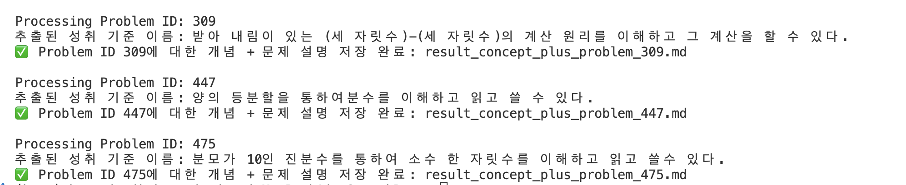
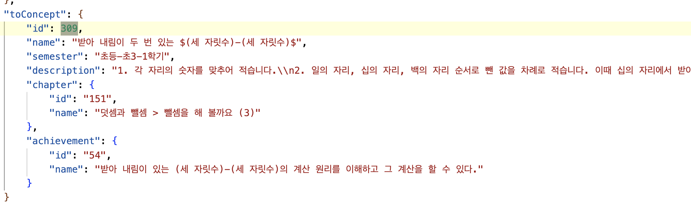

# 📚 Hails 프로젝트 - 학습자 상태 진단 및 개인화된 학습 가이드 시스템

## 🔍 프로젝트 개요

**Hails**는 학습자의 문제 풀이 이력을 기반으로 취약 개념을 예측하고, 이를 보완할 수 있는 문제와 설명을 자동으로 제공하는 **AI 기반 학습 지원 시스템**입니다.  
사교육 없이도 누구나 개인화된 학습이 가능하도록 도와주며, **교육 격차 해소**에 기여하고자 합니다.

---

## 🧠 핵심 기능

1. **DKT+ 기반 학습 상태 예측**  
   - 학습자의 과거 문제 풀이 이력을 바탕으로 정답률 분포를 예측  
   - LSTM 기반의 지식 추적 모델(DKT+)을 사용하여 시간적 패턴과 개념 간 관계를 효과적으로 반영  
   - AUC 0.815의 예측 성능 달성

2. **GPT-4o + RAG 기반 개념 가이드**  
   - 예측된 정답률이 낮은 문항을 **취약 개념**으로 분류  
   - 해당 개념을 GPT-4o에 질의하고, **RAG(Retrieval-Augmented Generation)** 기법을 통해 신뢰도 높은 답변 제공  
   - 사전 구축된 DB에서 정확한 지식만 추출해 **환각(hallucination)** 제거

3. **DKVMN을 통한 세부 역량 추적**  
   - Key-Value Memory 구조를 활용한 **Attention 기반 지식 추적 모델**  
   - 학습자의 개념별 이해도를 시간 흐름에 따라 시각화  
   - 히트맵 분석을 통해 중심 개념, 보조 개념, 기초 개념의 학습 패턴 추적 가능

---

## 🎯 주요 결과

- DKT+ 모델은 새로운 학생의 정답률 예측에 있어 높은 정확도를 보여줌
- DKVMN 모델은 학습자의 **개념 간 연관성과 학습 히스토리의 집중 시점**을 시각적으로 파악 가능
- 예측 결과를 기반으로 한 질의 응답 시스템은 **개인 맞춤형 학습 가이드 제공** 가능

---

## 💡 기대 효과

- 사교육 없이도 **개인화된 학습 방향 제공**
- 취약 개념 중심의 문제 추천 및 설명으로 **효율적인 보완 학습 가능**
- 공정한 교육 환경 조성 및 **학습 기회 격차 해소**

---

## 🎬 시연 영상 및 캡쳐본

---

