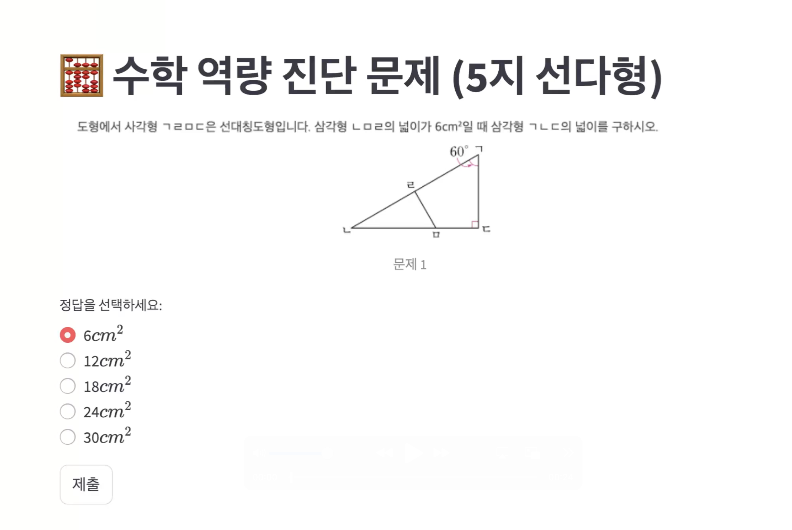
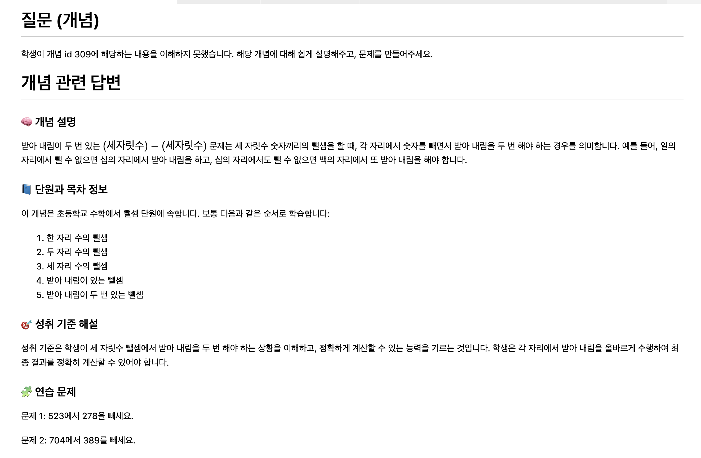

# (2025 zerothon) Hails 프로젝트 - 학습자 상태 진단 및 개인화된 수학 학습 가이드 시스템
# (2025 zerothon) Hails Project - Learner State Diagnosis and Personalized Mathematics Learning Guidance System

## 프로젝트 개요 (Project Overview)

Hails는 학습자의 문제 풀이 이력을 기반으로 취약 개념을 예측하고, 이를 보완할 수 있는 문제와 설명을 자동으로 제공하는 AI 기반 수학 학습 지원 시스템입니다.  
Hails is an AI-based mathematics learning support system that predicts weak concepts based on learners' problem-solving history and automatically provides relevant problems and explanations.
사교육 없이도 누구나 개인화된 학습이 가능하도록 도와주며, 교육 격차 해소에 기여하고자 합니다.  
It enables personalized learning without private tutoring, contributing to the reduction of educational gaps.

---

## 핵심 기능 (Core Features)

1. DKT+ 기반 학습 상태 예측 (DKT+ based Learning State Prediction)

   * 학습자의 과거 문제 풀이 이력을 바탕으로 정답률 분포를 예측  
     Predicts the accuracy distribution based on learners' historical problem-solving data.
   * LSTM 기반의 지식 추적 모델(DKT+)을 사용하여 시간적 패턴과 개념 간 관계를 효과적으로 반영  
     Uses an LSTM-based Knowledge Tracing model (DKT+) to effectively capture temporal patterns and concept relationships.
   * AUC 0.815의 예측 성능 달성  
     Achieved a prediction performance of AUC 0.815.

2. GPT-4o + RAG 기반 개념 가이드 (GPT-4o + RAG based Concept Guidance)

   * 예측된 정답률이 낮은 문항을 취약 개념으로 분류  
     Classifies items with low predicted accuracy as weak concepts.
   * 해당 개념을 GPT-4o에 질의하고, RAG(Retrieval-Augmented Generation) 기법을 통해 신뢰도 높은 답변 제공  
     Queries GPT-4o for these concepts and uses RAG (Retrieval-Augmented Generation) to provide highly reliable answers.
   * 사전 구축된 DB에서 정확한 지식만 추출해 환각(hallucination) 제거  
     Eliminates hallucination by extracting accurate knowledge from a pre-built database.

3. DKVMN을 통한 세부 역량 추적 (Detailed Competency Tracking via DKVMN)

   * Key-Value Memory 구조를 활용한 Attention 기반 지식 추적 모델  
     Attention-based knowledge tracing model utilizing Key-Value Memory structure.
   * 학습자의 개념별 이해도를 시간 흐름에 따라 시각화  
     Visualizes learners' understanding of concepts over time.
   * 히트맵 분석을 통해 중심 개념, 보조 개념, 기초 개념의 학습 패턴 추적 가능  
     Enables tracking of central, auxiliary, and basic concept learning patterns via heatmap analysis.

---

## 주요 결과 (Key Results)

* DKT+ 모델은 새로운 학생의 정답률 예측에 있어 높은 정확도를 보여줌  
  The DKT+ model demonstrates high accuracy in predicting new students' answer rates.
* DKVMN 모델은 학습자의 개념 간 연관성과 학습 히스토리의 집중 시점을 시각적으로 파악 가능  
  The DKVMN model visually identifies the relationships between concepts and focal points in learning history.
* 예측 결과를 기반으로 한 질의 응답 시스템은 개인 맞춤형 학습 가이드 제공 가능  
  The Q\&A system based on prediction results provides personalized learning guidance.

---

## 기대 효과 (Expected Benefits)

* 사교육 없이도 개인화된 학습 방향 제공  
  Provides personalized learning paths without private education.
* 취약 개념 중심의 문제 추천 및 설명으로 효율적인 보완 학습 가능  
  Facilitates efficient supplementary learning through targeted problem recommendations and explanations.
* 공정한 교육 환경 조성 및 학습 기회 격차 해소  
  Promotes a fair educational environment and reduces disparities in learning opportunities.

---

## 시연 영상 및 캡쳐본 (Demo Videos and Screenshots)

* 시연 영상 (Demo Video)
   

* 결과 제공 예시 (Examples of Results)
   
   
   

---

---

